# Git Flow

---
@title[Git Flow]

@snap[north span-50]
@ul[spaced text-white]
- Workflow Gitflow is model of branching about delivery (write by Vincent Driessen)
- git-flow => git extensions to provide high-level repository operations
@ulend
@snapend

@snap[south span-50]
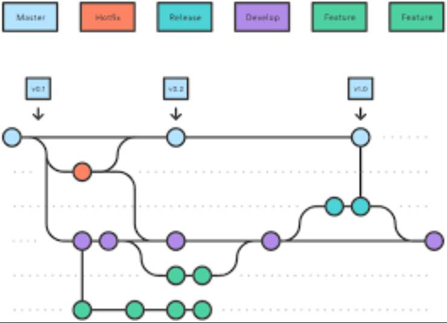
@snapend

---
@title[Git Flow : Init]

@snap[north span-50]
@ul[spaced text-white]
- git flow init => Initialize repository 
- Two branchs => master & develop
- master : official version
- develop : integration branch
@ulend
@snapend

@snap[south span-50]
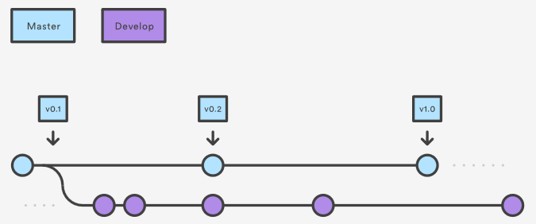
@snapend

---
@title[Git Flow : Features]

@snap[north span-50]
@ul[spaced text-white]
- One branch per functionnality (branch pushed to remote after for collaboration)
- feature branch is base to develop branch
- When feature is finished, branch is merged to develop
- feature doesn't use master branch
@ulend
@snapend

@snap[south span-50]
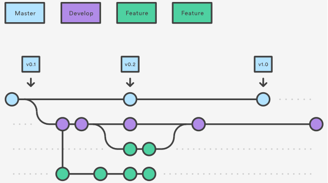
@snapend

---
@title[Git Flow : Releases]

@snap[north span-50]
@ul[spaced text-white]
- Release branch from develop
- No feature, just bug fixing
- Documentation, delivery etc ..
- Merge to master & develop (optional: create tag)
@ulend
@snapend

@snap[south span-50]
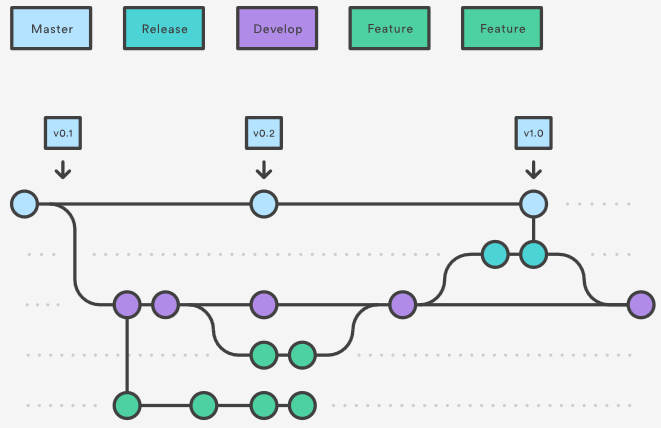
@snapend

---
@title[Git Flow : Hotfix]

@snap[north span-50]
@ul[spaced text-white]
- Branch from master (only for production hotfix)
- Merge to master & develop (or current release)
@ulend
@snapend

@snap[south span-50]
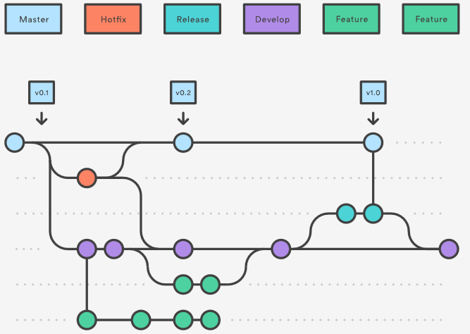
@snapend

---?color=#F6D365
@title[Workshop gitflow]
@box[bg-orange text-white rounded demo-box-pad](Workshop gitflow)

---
@title[Git flow : init]
@snap[north span-30]
### git flow init
@snapend

@snap[south span-70]
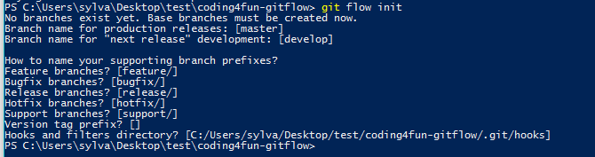
@snapend

---
@title[Git flow : list branch]
@snap[north span-30]
### git branch --list
@snapend

@snap[south span-70]

@snapend

---
@title[Git flow : add new feature]
@snap[north span-30]
### git flow feature start <feature_name>
@snapend

@snap[south span-70]
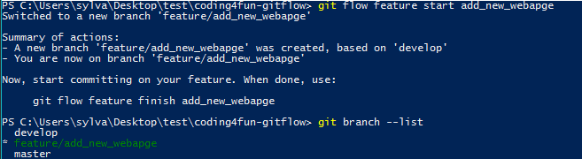
@snapend

---
@title[Git flow : changes feature]
@snap[north span-30]
### git commit -m 'Commit feature'
### git push origin feature/<feature_name>
@snapend

@snap[south span-70]
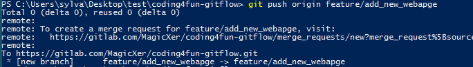
@snapend

---
@title[Git flow : finish feature]
@snap[north span-30]
### git flow feature finish <feature_name>
### Don't forget to push develop
@snapend

@snap[south span-70]
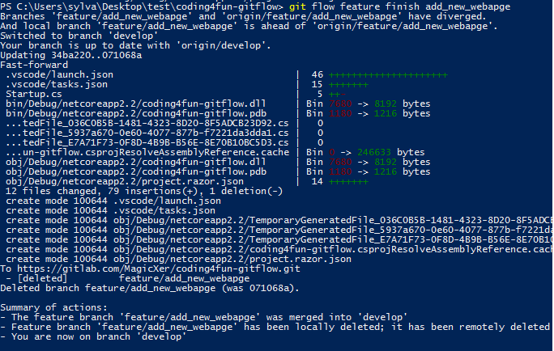
@snapend

---
@title[Git flow : add new release]
@snap[north span-30]
### git flow release start <release_version>
@snapend

@snap[south span-70]
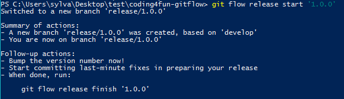
@snapend

---
@title[Git flow : changes release]
@snap[north span-30]
### git commit + push release
@snapend

@snap[south span-70]
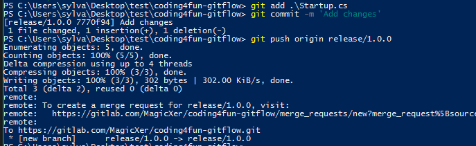
@snapend

---
@title[Git flow : finish release]
@snap[north span-30]
### git flow release finish <release_version>
### Don't forget to push develop and master
@snapend

@snap[south span-70]
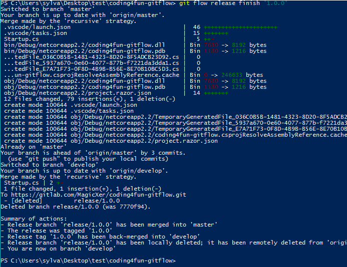
@snapend